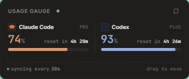

<h1 align="center">Usage Gauge</h1>

<p align="center">
  <em>Claude Code & Codex usage, always one glance away.</em>
</p>

<p align="center">
  
</p>

<p align="center">
  
  
  
</p>

---

## Why Usage Gauge?

Getting cut off mid-session by Claude Code or Codex usage limits breaks flow at exactly the wrong time. **Usage Gauge** keeps the remaining quota visible in a small always-on-top widget, so you can pace long coding sessions before the CLI stops you.

> **No API keys. No extra auth. No data leaves your machine.**
> If the CLI works in your terminal, it works here.

---

## ✨ Features

- 📊 **Real-time gauges** for Claude Code `/usage` and Codex `/status`
- 🪟 **Always-on-top** floating widget with a minimal footprint
- 🔐 **Zero credentials** — reuses your existing CLI session
- 🔄 **Auto-sync** every 30 seconds
- 🖱️ **Drag-to-move** anywhere on screen
- 💻 **Cross-platform** Electron app (Windows primary, macOS secondary)

---

## 🚀 Quick Start

> 🧪 **Beta** — prebuilt binaries coming soon. For now, run from source.

### Prerequisites

- **Node.js 18+**
- [**Claude Code**](https://docs.claude.com/en/docs/claude-code) and/or [**Codex CLI**](https://github.com/openai/codex) installed and signed in

### Run From Source

```bash
git clone https://github.com/heebum1234/usage-gauge.git
cd usage-gauge
npm install
npm run dev
```

Without dev mode:

```bash
npm start
```

### Build a Windows Package

```bash
npm run build
```

Artifacts are written under `dist\`.

---

## 🔍 How It Works

Usage Gauge spawns a local terminal session for each configured CLI, runs the same slash command you would type by hand (`/usage` for Claude Code, `/status` for Codex), and parses the output into a remaining-usage gauge.

```
┌──────────────┐      ┌──────────────┐      ┌──────────────┐
│  CLI session │ ───▶ │  Parse output │ ───▶ │  Render gauge│
└──────────────┘      └──────────────┘      └──────────────┘
```

No service API keys. No tokens. No telemetry. Just your existing CLI auth, read locally.

---

## 🗺️ Roadmap

- [ ] Prebuilt binaries for Windows (`.exe`) and macOS (`.dmg`)
- [ ] `winget` and `brew` distribution
- [ ] Configurable warning thresholds
- [ ] Auto-start and tray / menu-bar controls

---

## 🤝 Contributing

Issues and PRs are welcome. If you are hitting CLI usage limits and have a workflow this widget should support, please open an issue with:

- Your platform (Windows / macOS)
- The CLI and version (`claude --version`, `codex --version`)
- The usage output shape, if possible

---

## 📄 License

[MIT](LICENSE) © Heebum Jeong
